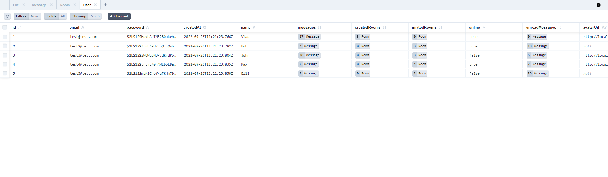

# Chat backend

**Стек** - Node.js, Nest.js, socket.io, Prisma, sqlite

**Особенности**

-  Авторизация по jwt
-  Socket.io для обмена сообщениями
-  Оптимизация изображений - преобразование в webp
-  Создание/редактирование/удаление сообщений
-  Загрузка файлов

